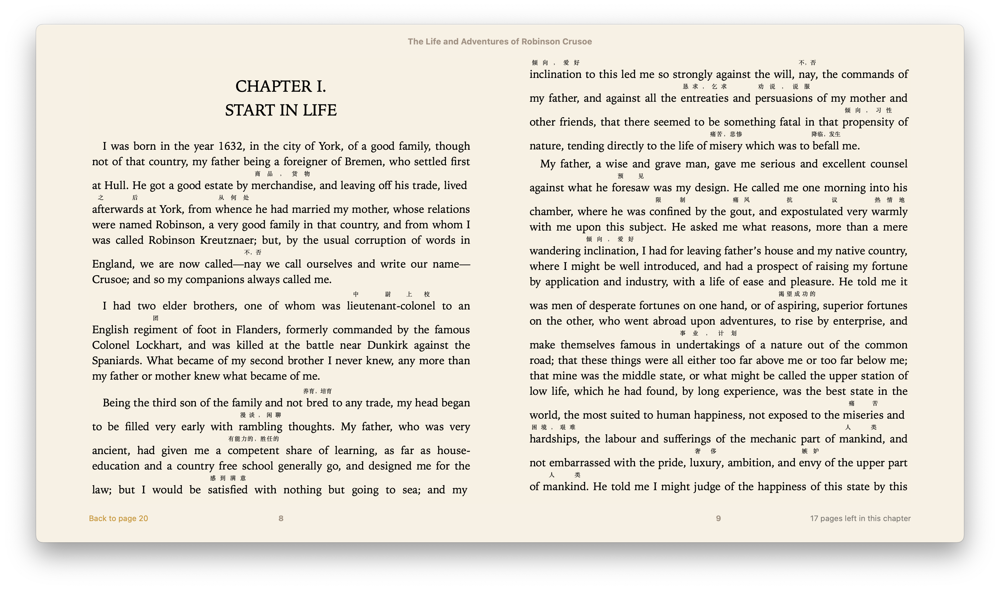

# enladder-books

为了解决学英语的难题，之前用 Kindle 的电子书有一个 Word Wise 功能，可以将难词提示出来。不过 Kindle 在中国下线了，于是我自己制作了一些需要的电子书。

现在开源出来。

在 Mac 自带阅读器打开的效果如下，Kindle 和 多看都可以使用：

## 带中文难词提示的电子书清单(持续更新)

- ✅ 鲁滨逊漂流记 / The Life and Adventures of Robinson Crusoe by Daniel Defoe
- ✅ 傲慢和偏见 / Pride and Prejudice by Jane Austen
- ✅ 时间旅行 / The Time Machine by H. G. Wells
- ✅ 爱丽丝梦游仙境 / Alice's Adventures in Wonderland by Lewis Carroll
- ✅ 地心游记 / A Journey to the Centre of the Earth by Jules Verne
- ✅ 了不起的盖茨比 / The Great Gatsby by F. Scott Fitzgerald
- ✅ 迷失的世界 / The Lost World by Arthur Conan Doyle
- ✅ 月亮与六便士 / The Moon and Sixpence by W. Somerset Maugham
- ✅ 论人类不平等的起源和基础 / A Discourse Upon the Origin and the Foundation of the Inequality Among Mankind
- ✅ 论语英文版 / The Analects of Confucius (from the Chinese Classics) by Confucius

## 制作原理

根据高频词库提取 5000 词以上的单词作为难词，在书籍中做了标注，如果需要背 5000 高频词汇，可以找到 frequency-word 目录，我准备了高频词汇清单文件。

## 电子书源文件来源清单

- The Life and Adventures of Robinson Crusoe by Daniel Defoe
- Pride and Prejudice by Jane Austen
- Alice's Adventures in Wonderland by Lewis Carroll https://www.gutenberg.org/ebooks/11
- The Time Machine by H. G. Wells https://www.gutenberg.org/ebooks/35
- The Great Gatsby by F. Scott Fitzgerald https://www.gutenberg.org/ebooks/64317
- A Journey to the Centre of the Earth by Jules Verne https://www.gutenberg.org/ebooks/18857
- The Lost World by Arthur Conan Doyle https://www.gutenberg.org/ebooks/139
- The Moon and Sixpence by W. Somerset Maugham https://www.gutenberg.org/ebooks/222
- The Art of Public Speaking by J. Berg Esenwein and Dale Carnegie https://www.gutenberg.org/ebooks/16317
- A Discourse Upon the Origin and the Foundation of the Inequality Among Mankind https://www.gutenberg.org/ebooks/11136
- The Analects of Confucius (from the Chinese Classics) by Confucius https://www.gutenberg.org/ebooks/3330
- A Hundred and Seventy Chinese Poems by Arthur Waley https://www.gutenberg.org/ebooks/42290
- Treasure Island by Robert Louis Stevenson https://www.gutenberg.org/ebooks/120
- Oliver Twist by Charles Dickens https://www.gutenberg.org/ebooks/730
- The Art of War by active 6th century B.C. Sunzi https://www.gutenberg.org/ebooks/132
- Anna Karenina by graf Leo Tolstoy https://www.gutenberg.org/ebooks/1399
- The Awakening, and Selected Short Stories by Kate Chopin https://www.gutenberg.org/ebooks/160
- Tractatus Logico-Philosophicus by Ludwig Wittgenstein https://www.gutenberg.org/ebooks/5740
- Twenty Thousand Leagues under the Sea by Jules Verne https://www.gutenberg.org/ebooks/164
- Complete Original Short Stories of Guy De Maupassant by Guy de Maupassant https://www.gutenberg.org/ebooks/3090
- Aesop's Fables; a new translation by Aesop https://www.gutenberg.org/ebooks/11339
- The art of money getting : or, golden rules for making money by P. T. Barnum https://www.gutenberg.org/ebooks/8581
- The Twilight of the Idols; or, How to Philosophize with the Hammer. The… https://www.gutenberg.org/ebooks/52263
- Around the World in Eighty Days by Jules Verne https://www.gutenberg.org/ebooks/103
- The Thousand and One Nights, Vol. I. by Lane, Lane-Poole, Poole, and Harvey https://www.gutenberg.org/ebooks/34206
- Twelve Years a Slave by Solomon Northup https://www.gutenberg.org/ebooks/45631
- The Declaration of Independence of the United States of America by Thomas Jefferson https://www.gutenberg.org/ebooks/1
- Compilation of Short Stories by Chekhov by Chekhov https://www.gutenberg.org/ebooks/57333
- Great short stories, Volume 1 (of 3) : Detective stories by William Patten https://www.gutenberg.org/ebooks/74548
- Fairy Tales of Hans Christian Andersen by H. C. Andersen https://www.gutenberg.org/ebooks/27200
- Politics: A Treatise on Government by Aristotle https://www.gutenberg.org/ebooks/6762
- The Way of the World by William Congreve https://www.gutenberg.org/ebooks/1292
- Short Stories by Fyodor Dostoyevsky https://www.gutenberg.org/ebooks/40745
- Grimms' Fairy Tales by Jacob Grimm and Wilhelm Grimm https://www.gutenberg.org/ebooks/2591
- The Kama Sutra of Vatsyayana by Vatsyayana https://www.gutenberg.org/ebooks/27827